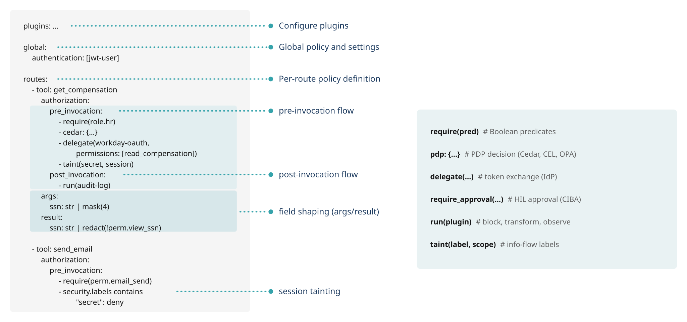

# APL: configuring enforcement pipelines

APL (Authorization Policy Layer) defines PPE enforcement pipelines. Each
capability an agent may invoke (e.g., a tool, resource, prompt, or A2A method)
defines a route that sequences its boundary controls.



APL configuration comprises routes, phases, predicates, rules, and field
pipelines:

- [Effects & Sequencing](effects.md): the effects a rule can run, halt-on-deny
  ordering, and composition.
- [PDP Integration](pdp.md): hand a decision to Cedar, CEL, or an external
  engine.
- [Identity & IdP](identity.md): how callers are resolved into the attributes
  predicates read.
- [Static Attributes](attributes.md): operator-maintained config facts in the
  `data.*` namespace.
- [Delegation](delegation.md): mint scoped downstream credentials via token
  exchange.
- [Elicitation](elicitation.md): pause an operation for human approval and
  resume on retry.
- [Session Taint](tainting.md): information-flow control across requests.
- [Backend Restriction](restrict.md): shape which backends the router may select
  for a request.

## Routes and phases

Policy is organized by route: an operation PPE mediates, identified by the
tool or other interface it governs. Each route runs through four
phases, in order:


- args: validate and transform request inputs before the operation runs.
- authorization.pre_invocation: authorize the operation. Predicates, PDP
  calls, Token Exchange / Delegation, and Session Taint.
- result: transform the response. Redaction and masking on the wire.
- authorization.post_invocation: checks after the result is known. Audit,
  post-delegation verification.

The first `deny` in any phase halts that phase and every later phase. Nothing
reaches the backend after a deny in `args` or `authorization.pre_invocation`.

`authorization` names *when* the phase runs, not a pure allow/deny gate:
alongside the decision, `pre_invocation` (and `post_invocation`) can carry
obligations and effects — `taint(...)`, `delegate(...)`, and `run(...)`
(which may transform the payload) — that run as part of the phase.

```yaml
routes:
  - tool: get_employee
    args:
      employee_id: "str"
    authorization:
      pre_invocation:
        - "require(authenticated)"
        - "delegation.depth > 2: deny"
    result:
      ssn: "str | redact(!perm.view_ssn)"
      salary: "int | redact(!role.hr)"
      employee_id: "str | mask(4)"
```

`pre_invocation:` and `post_invocation:` nest under `authorization:`. Each phase
is an ordered list of rules and effects. An `authorization:` block contains at
least one phase.

## Predicates

A predicate reads attributes resolved from the caller's identity and request
context (see [Identity](identity.md) for where attributes come from). The forms:

- Truthiness: a bare attribute is true when present and truthy.
  `authenticated`, `role.hr`, `perm.view_ssn`.
- Comparison: `delegation.depth > 2`, `client.trust_level == 'trusted'`.
  Operators: `==`, `!=`, `>`, `>=`, `<`, `<=`.
- Set membership: `subject.id in authorized_users`, `subject.id not in
  banned_list`.
- Existence: `exists(delegation.origin_subject_id)` is true when the
  attribute is present.
- Containment: `security.labels contains "secret"`.
- Logical composition: `&` (and), `|` (or), `!` (not). Precedence is `()` >
  `!` > `&` > `|`.

<!-- validate: phase-list -->
```yaml
- "(role.hr | role.security) & !delegated"
```

## Rules

A `pre_invocation:` (or `post_invocation:`) entry is a rule. Two forms:

`require(...)` denies unless the predicate holds:

<!-- validate: phase-list -->
```yaml
- "require(authenticated)"
- "require(role.hr)"
- "require(!delegated)"
```

`require(a, b)` denies if either is false (an implicit and). `require(a | b)`
denies only if both are false.

`predicate: effect` runs the effect when the predicate holds:

<!-- validate: phase-list -->
```yaml
- "delegation.depth > 2: deny"
- "security.labels contains \"secret\": deny('session touched secret data', 'session_tainted')"
```

`deny` takes an optional reason and code: `deny`, `deny('reason')`, or
`deny('reason', 'code')`. The code is surfaced to the caller and the audit log.

For richer conditionals, use the `when` / `do` form, where `do` is a single
effect or a list:

<!-- validate: phase-list -->
```yaml
- when: "role.hr & !perm.view_ssn"
  do:
    - "taint(restricted, session)"
    - "run(audit-log)"
```

## Custom denial response

By default a deny surfaces a reason and code, and the host renders its own
denial. A route can instead attach a custom HTTP response — status, body,
headers — through a `response:` block, a sibling of the route's `authorization:`
block:

```yaml
routes:
  - tool: locked
    authorization:
      pre_invocation:
        - "require(authenticated)"
    response:
      status: 403
      body: "{\"error\":\"forbidden\"}"
      headers:
        WWW-Authenticate: "Bearer"
```

All three fields are optional; an absent block leaves the host's default denial
unchanged. When the route denies, the status/body/headers are carried on the
violation for the host to render on the wire. `response:` is honored at route
scope and at `global` scope (below); it is inert — and warns at load time —
under `defaults` or a policy bundle. It is scope-local: a `global` `response:`
is not inherited by entity routes.

## Authorizing HTTP requests without an entity

Routes key on tool, prompt, resource, or LLM. A generic
HTTP request that carries no such entity is authorized by the `global`
policy instead, or by an `http:` route that selects on the request line
(see [HTTP Routing](../http-routing.md)). When `global` declares an
`authorization:` (or `args:`) block, PPE evaluates it for these requests,
reading the request line (`http.method`, `http.path`, `http.host`,
`http.scheme`) and headers. Pair it with a `global` `response:` to return a
custom denial.

```yaml
global:
  authorization:
    pre_invocation:
      - "http.method != 'GET': deny"
  response:
    status: 405
    headers:
      Allow: "GET"
```

The host must populate `http.host` from a validated request authority, never a
raw client `Host` header, so host-based predicates cannot be spoofed by the
caller.

## Field pipelines

`args:` and `result:` map a field to a pipeline of stages separated by `|`.
Stages run left to right; a failed validator denies the phase.

<!-- validate: route-body -->
```yaml
result:
  ssn: "str | redact(!perm.view_ssn)"
  email: "email"
  employee_id: "str | mask(4)"
```

The accepted stages:

| Category | Stages |
|----------|--------|
| Type validators | `str`, `int`, `bool`, `float`, `email`, `url`, `uuid` |
| Constraint validators | `enum(a, b, c)`, `regex("...")`, `len(1..100)`, range like `0..100` |
| Transforms | `mask(N)` (keep last N), `redact`, `redact(!predicate)` (redact unless), `omit`, `hash` |
| Scans | `pii.redact`, `pii.detect`, `injection.scan` |
| Dispatch | `run(name)`, `taint(label[, scope])` |

`plugin(name)` is not a spelling here or in step position. `run(name)` is
the one form that invokes a plugin, in a step list and a pipe chain
alike, and writing `plugin(name)` is an error naming the replacement.

Named-validator dispatch (`validate(name)`) is refused rather than
unimplemented. The stub would have let every value through, which is a
silent hole in a validator. Use `regex("...")` for a pattern check, or
`run(name)` to hand the field to a plugin.

## Effects beyond predicates

A `pre_invocation:` rule can also call a decision point, mint a delegated
token, or invoke a plugin. Those effects and how they sequence are
covered in [Effects](effects.md).

## Beside the policy

Two blocks sit alongside `authorization:` on the same sections and are
not policy terms themselves:

- `assertions:` renders engine-derived identity onto the upstream
  request as headers and filters what an upstream may tell a client
  back. It runs after the applicable policy phase. See
  [Header Assertions](../assertions.md).
- `authentication:` names the identity-resolution plugins that run
  before policy. See [Identity](identity.md).

Every fragment on this page is drawn from the `praxis-policy-apl-core` parser
tests and the
reference deployments, so the forms shown here parse as written.

## Next

- [APL Grammar](apl-grammar.md): the normative syntax and accepted forms.
- [Effects and Sequencing](effects.md): effect ordering, composition, and
  halt-on-deny behavior.
