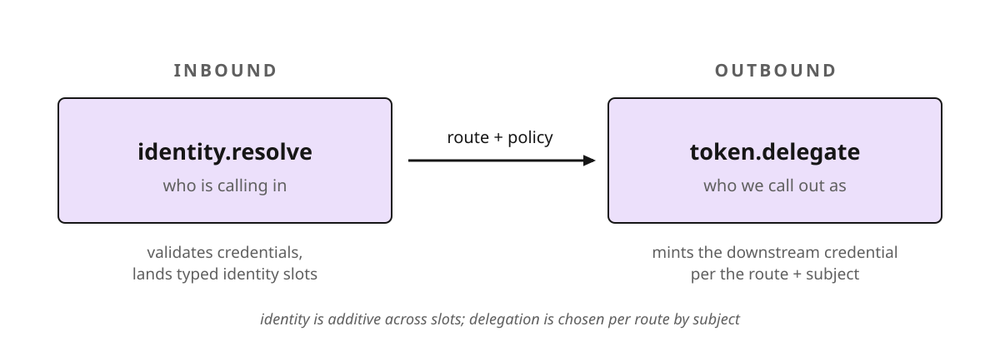

# Identity and Token Exchange / Delegation

PPE resolves the inbound caller and mints the outbound credential on every
request. Select the recipe matching the required principal, copy its plugin and
route configuration, then check the support matrix for tested IdPs.

The same config runs wherever you place it: in front of the tools, inside the
tool server, or agent-side (see [Where to place PPE](#where-to-place-ppe)).
Throughout this page "the enforcement point" means "wherever this PPE instance
runs."

For the conceptual model first, read [Use Cases](use-cases.md) and
[Deployment](deployment.md); for the full config schema, see
[Configuration](configuration.md).

## The model in one picture

Every request crosses two identity boundaries:



- Inbound. `identity.resolve` plugins each read one credential (from a
  header) and land a typed identity in a slot. They are additive: one request
  can carry a user token *and* a workload SVID, both validated.
- Outbound. A `delegate(...)` step in the route runs a `token.delegate`
  plugin that mints the credential attached to the upstream call. The step's
  `subject:` chooses what the minted token *speaks for*.

## Building blocks

### Identity slots (inbound)

| Slot | Who it is | Typical header | Resolver |
|---|---|---|---|
| `subject` | the human on whose behalf the call is made | `X-User-Token` | `identity/jwt` (`role: user`) |
| `client` | the OAuth app / agent as a registered client | `Authorization` | `identity/jwt` (`role: client`) |
| `caller_workload` | the *calling workload's own* identity (e.g. a SPIFFE SVID) | `X-Workload-Token` | `identity/jwt` (`role: caller_workload`) |

### Delegation subjects (outbound)

The `subject:` on a `delegate(...)` step decides the OAuth mechanism the
delegator uses:

| `subject:` | Minted token speaks for | Mechanism |
|---|---|---|
| `user` (default) | the human, on-behalf-of | RFC 8693 token exchange (`subject_token` = the user's token) |
| `caller_workload` | the calling agent, as itself | RFC 7523 client assertion (the SVID) → then scope down |
| `this_workload` | the PPE instance's own identity, as itself, no inbound credential | RFC 6749 §4.4 `client_credentials` |

> `this_workload` names *this PPE instance acting as its own identity*, whatever
> you've deployed it as. It does not claim PPE is a gateway. (`gateway` is
> accepted as a deprecated alias.)

### "I want to…" → mechanism

| I want to… | Use | Spec |
|---|---|---|
| act as a service with no user | `subject: this_workload` → `client_credentials` | RFC 6749 §4.4 |
| act on behalf of a signed-in user | `subject: user` → token exchange | RFC 8693 |
| let a workload authenticate as *itself* by its SVID | `subject: caller_workload` → client assertion | RFC 7523 + `draft-ietf-oauth-spiffe-client-auth` |
| record both the user *and* the calling agent in the token | `subject: user`, `actor: caller_workload` | RFC 8693 `actor_token` |
| forward a token the caller already obtained | no `delegate`, pass the header through | — |

---

## Scoping: how broadly to apply it

PPE resolves the pipeline for each request across one broad → narrow stack,
and both identity and policy (including delegation) ride it. Narrower layers
add to (or override) broader ones. Pick the broadest layer that's still
correct.

A group is a named, reusable bundle of policy (authentication steps +
authorization steps + plugins) that routes opt into. The layers, broad to
narrow:

| Layer | Applies to | Identity uses… | Policy / delegation uses… |
|---|---|---|---|
| Global | every request | `global.authentication` | always-on global policy |
| Default (per entity type) | every tool / prompt / resource | — | `global.defaults.<tool\|prompt\|resource>` |
| Group | routes that join `<name>` (via `groups:` or a matching tag) | `groups.<name>.authentication` | `groups.<name>.authorization` / `plugins` |
| Route (entity) | one route (a `tool: "*"` route is the catch-all) | route `authentication:` | route `authorization:` steps / `plugins:` |

`delegate(...)` is not route-only. Place it (or a
`token.delegate` plugin) at the matching layer:

- every tool → a `delegate()` in a `tool: "*"` route, or the delegator
  plugin in `defaults.tool`,
- a class of tools → a group,
- one tool → a specific route (which overrides the `*` default; more
  specific wins).

### The stack in one config

```yaml
plugins:
  - name: jwt-user
    kind: identity/jwt
    hooks: [identity.resolve]
  - name: jwt-manager
    kind: identity/jwt
    hooks: [identity.resolve]
  - name: workday-oauth
    kind: delegator/oauth
    hooks: [token.delegate]

global:
  authentication: [jwt-user]            # every request gets user identity

groups:
  hr-tools:
    authentication: [jwt-manager]       # + manager identity for this group
    authorization:
      pre_invocation:
        - "require(role.hr)"            # + policy for this group

routes:
  - tool: get_compensation
    groups: hr-tools                    # join the group: jwt-user + jwt-manager, require(role.hr)
    authorization:
      pre_invocation:
        - "delegate(workday-oauth, target: workday-api, audience: workday-api, permissions: [read_compensation])"
```

`groups: hr-tools` is the first-class way to join a group, and it is sugar
over tags: `meta: { tags: [hr-tools] }` is exactly equivalent, and
host-injected runtime tags join groups the same way.

The override. A route that must stand alone drops the inherited layers:

```yaml
plugins:
  - name: jwt-workload
    kind: identity/jwt
    hooks: [identity.resolve]

routes:
  - tool: get_directory
    authentication:
      replace_inherited: true           # ignore global + group layers
      steps: [jwt-workload]             # authenticate by the SVID alone
```

That is what [Recipe 2](#recipe-2-agent-acting-as-itself-by-its-spiffe-svid)
uses. (Full group / defaults syntax: [Configuration](configuration.md).)

### Rule of thumb

| You want… | Put it at |
|---|---|
| the same identity everywhere | global `authentication` |
| a recurring identity/plugin set across many tools | a group |
| one route handled differently, standalone | a route (`authentication: replace_inherited` for identity) |
| one delegation for most tools, exceptions for a few | a default (`tool: "*"` route or `defaults.tool`) + specific overrides |

---

## Recipes

Each recipe is a drop-in: the plugins it needs, the route layout, and where
it's been tested. All config is [unified-config](configuration.md) YAML.

> One spelling. These recipes write policy under `authorization:`,
> with `pre_invocation:` and `post_invocation:` inside it. That is now
> the only spelling. The `apl:` wrapper is gone at every scope, and a
> phase list written flat on a route is a load error. Both were
> accepted once; see [Upgrading APL](../upgrade-apl.md) for the rewrite.

### Recipe 1: User acting through an agent (on-behalf-of)

When: a human is signed in; the agent calls a downstream API *as that user*.
PPE exchanges the user's IdP token for a downstream-audience token.

```yaml
plugins:
  - name: jwt-user
    kind: identity/jwt
    hooks: [identity.resolve]
    config:
      role: user
      header: X-User-Token
      trusted_issuers:
        - issuer: "https://idp.example.com/realms/corp"
          audiences: ["ppe"]        # the audience the user token is minted for
          algorithms: ["RS256"]
          decoding_key: { kind: jwks_url, url: "https://idp.example.com/realms/corp/protocol/openid-connect/certs" }

  - name: workday-oauth
    kind: delegator/oauth
    hooks: [token.delegate]
    capabilities: [read_inbound_credentials, write_delegated_tokens]
    config:
      token_endpoint: "https://idp.example.com/realms/corp/protocol/openid-connect/token"
      client_id: "ppe"              # this PPE instance's own OAuth client
      client_secret_source: { kind: env_var, name: IDP_CLIENT_SECRET }

global:
  authentication: [jwt-user]

routes:
  - tool: get_compensation
    authorization:
      pre_invocation:
        - "require(role.hr)"
        - "delegate(workday-oauth, target: workday-api, audience: workday-api, permissions: [read_compensation])"
```

The minted `workday-api` token is attached to the upstream call. Tested:
Keycloak 26.x (Standard Token Exchange v2).

### Recipe 2: Agent acting as itself, by its SPIFFE SVID

When: the *agent* is the principal (no human), and you don't trust the agent
to hold downstream authority. The agent presents its SVID; PPE brokers a
scoped downstream token. The agent holds no standing entitlement to the
target.

> The SVID is a JWT, but not an IdP token. A JWT-SVID is an `ES256` JWT
> signed by *SPIRE* (validated against SPIRE's JWKS, not your IdP's): a SPIFFE
> identity credential, not an OAuth access token. It can't be forwarded to the
> downstream or used as a bearer/subject token as-is; PPE must turn it into
> an IdP-issued token first (leg 1 below). Contrast [Recipe
> 5](#recipe-5-scope-a-token-the-agent-already-holds-1-leg), whose input is a
> token already *minted from* an SVID.

Add a workload resolver, scoped to the route so only it runs there:

```yaml
plugins:
  - name: jwt-workload
    kind: identity/jwt
    hooks: [identity.resolve]
    on_error: fail
    config:
      role: caller_workload
      header: X-Workload-Token
      trusted_issuers:
        - issuer: "https://spire-oidc.internal:8443"   # SPIRE OIDC discovery
          audiences: ["https://idp.example.com/realms/corp"]   # SVID aud = the IdP
          algorithms: ["ES256"]                                # SVIDs are EC-signed
          decoding_key: { kind: jwks_url, url: "https://spire-oidc.internal:8443/keys" }

routes:
  - tool: get_directory
    # Authenticate this route by the SVID alone: drop the global user/client
    # resolvers. `jwt-workload` is NOT in global.authentication.
    authentication:
      replace_inherited: true
      steps: [jwt-workload]
    authorization:
      pre_invocation:
        - "delegate(workday-oauth, target: workday-api,
                    audience: workday-api,
                    permissions: [read_compensation],
                    subject: caller_workload)"
        - "!delegation.granted: deny"
```

For `subject: caller_workload`, the OAuth delegator runs two legs: leg 1
presents the SVID as an RFC 7523 `client_assertion` (type `…:jwt-spiffe`) to
authenticate the agent as its IdP client; leg 2 exchanges that for the scoped
downstream token. The IdP side needs a SPIFFE identity provider (validates the
SVID against SPIRE's trust bundle) and a client bound to that SVID via
SPIFFE/federated client authentication; consult your IdP's SPIFFE client-auth
docs. Tested: Keycloak 26.6 (feature `spiffe:v1`).

> Why route-scope it: keeping the workload authority off the agent's own
> identity, and requiring the enforcement point's credential for the scope-up,
> is what makes PPE the trust boundary. A compromised agent can prove who it is
> but cannot mint the downstream token itself.

### Recipe 3: A service acting as itself

When: PPE calls a downstream as *itself*, with no inbound credential to exchange
(e.g. a scheduled job, or PPE's own housekeeping).

```yaml
routes:
  - tool: sync_directory
    authorization:
      pre_invocation:
        - "delegate(svc-oauth, target: workday-api, audience: workday-api, subject: this_workload)"
```

`subject: this_workload` switches the delegator to `client_credentials`: no
`subject_token`, PPE's own `client_id`/secret is the identity. Tested:
Keycloak (client_credentials).

### Recipe 4: Forward a token the caller already has (passthrough)

When: the agent authenticated to the IdP itself and hands PPE a ready token.
PPE validates it inbound and lets the route forward it, with no `delegate` step.
This is the "agent-brokered" case; it needs no delegation code, only that the
inbound resolver validates the token and the route allows the call.

### Recipe 5: Scope a token the agent already holds (1-leg)

When: the agent authenticated to the IdP *itself* with its SVID and got back
a normal JWT, and you still want PPE to narrow that token per-tool (least
privilege at the boundary) without ever handling the SVID.

> The token is not the SVID. The agent presented its SVID as a
> `client_assertion` *upstream* and received an ordinary IdP access token. That
> token arrives here like a user token: same header, same JWKS validation,
> `RS256` (an IdP-signed JWT), *not* the `ES256` SVID. PPE never sees the SVID;
> it sees a normal token.

```yaml
plugins:
  - name: jwt-agent
    kind: identity/jwt
    hooks: [identity.resolve]
    config:
      role: client                 # the agent as an OAuth client
      header: Authorization        # a normal bearer token, NOT X-Workload-Token
      trusted_issuers:
        - issuer: "https://idp.example.com/realms/corp"
          audiences: ["ppe"]
          algorithms: ["RS256"]    # an IdP-issued JWT, not the ES256 SVID
          decoding_key: { kind: jwks_url, url: "https://idp.example.com/realms/corp/protocol/openid-connect/certs" }
routes:
  - tool: get_directory
    authorization:
      pre_invocation:
        - "delegate(workday-oauth, target: workday-api,
                    audience: workday-api,
                    permissions: [read_compensation],
                    subject: client)"
```

This is a plain RFC 8693 exchange, the same engine as [Recipe
1](#recipe-1-user-acting-through-an-agent-on-behalf-of), scoping the
*agent's* token instead of a user's. One leg (the scope): the agent did
the authenticate leg upstream, so PPE doesn't.

Don't confuse this with Recipe 2. The trigger is *what the agent presents*:
an SVID, or a token minted from one:

| Agent presents | Slot → subject | PPE does | Legs |
|---|---|---|---|
| its SVID (`ES256`, SPIRE JWKS) | `caller_workload` → `subject: caller_workload` | authenticate + scope | 2 (Recipe 2) |
| a token minted from its SVID (`RS256`, IdP JWKS) | `client` → `subject: client` | scope only | 1 (this recipe) |
| a token already right for the tool | — | forward as-is | 0 (Recipe 4) |

Using `subject: caller_workload` on an already-minted token misroutes it down
the two-leg `client_assertion` path.

### Recipe 6: User acting through an agent, with the agent named (dual-principal)

When: a human is signed in *and* you want the record to name the agent that
carried out the call. The minted token speaks for the user (`sub`), and PPE
additionally names the calling agent as the RFC 8693 acting party (`act`), so a
token service that honors delegation records both who authorized the action and
who performed it.

It composes two inbound resolvers: `jwt-user` ([Recipe
1](#recipe-1-user-acting-through-an-agent-on-behalf-of)) for the human on
`X-User-Token`, and `jwt-workload` ([Recipe
2](#recipe-2-agent-acting-as-itself-by-its-spiffe-svid)) for the agent's SVID on
`X-Workload-Token`. Both must resolve; both credentials arrive on every call.

```yaml
plugins:
  - name: jwt-user            # Recipe 1
    kind: identity/jwt
    hooks: [identity.resolve]
  - name: jwt-workload        # Recipe 2
    kind: identity/jwt
    hooks: [identity.resolve]
  - name: workday-oauth
    kind: delegator/oauth
    hooks: [token.delegate]

global:
  authentication: [jwt-user, jwt-workload]   # run both

routes:
  - tool: get_compensation
    authorization:
      pre_invocation:
        - "require(role.hr)"
        - "delegate(workday-oauth, target: workday-api, audience: workday-api,
                    permissions: [read_compensation],
                    subject: user, actor: caller_workload)"
```

`subject: user` makes the user's token the RFC 8693 `subject_token` (exactly as
[Recipe 1](#recipe-1-user-acting-through-an-agent-on-behalf-of)); `actor:
caller_workload` *additionally* attaches the agent's SVID as the `actor_token`,
requesting that the minted token carry `act` alongside `sub`. This is one
exchange call with two principals in the request, not a second leg. `actor`
accepts only inbound credentials (`user`, `client`, `caller_workload`): the
acting party is by definition one that presented itself to PPE.

> Subject vs. actor. The *subject* is who the token speaks *for* (whose
> authority); the *actor* is who is *doing* it (attribution). Least-privilege
> scoping still follows the subject. The `act` claim records the agent, it
> doesn't grant it anything.

Which actor, `client` or `caller_workload`? Match it to *how the agent
authenticated*. An agent that presented a SPIFFE SVID is a `caller_workload`
(above); one that authenticated as a registered OAuth client (an `Authorization`
bearer token, resolved with `role: client`) is `actor: client`:

<!-- validate: phase-list -->
```yaml
- "delegate(workday-oauth, target: workday-api, audience: workday-api,
            permissions: [read_compensation], subject: user, actor: client)"
```

> Valid combinations. `actor:` pairs with `subject: user` or `subject:
> client`, the on-behalf-of shape. It is not supported with `subject:
> caller_workload` (the workload is already the subject) or `subject:
> this_workload` (a `client_credentials` grant carries no `actor_token`); PPE
> rejects those at config time rather than silently dropping the actor.

PPE side: implemented and e2e-tested against a mock IdP. The delegator puts the
actor on the wire exactly as RFC 8693 delegation prescribes (`actor_token` +
`actor_token_type`), and omits it when no actor is configured.

> Interop: `act` is the token service's job (impersonation vs. delegation).
> RFC 8693 (§1.1) exchanges come in two flavors. *Impersonation* returns a token
> that speaks purely for the subject, indistinguishable from one the subject
> fetched directly, with no `act` claim. *Delegation* additionally records
> the actor in a nested `act`. The `actor_token` parameter is what asks for
> delegation; only a token service that implements the delegation path emits
> `act`. PPE always sends the delegation request, but the claim only appears
> if the service honors it.
>
> Keycloak does not. Keycloak's Standard Token Exchange (v2, tested here on
> 26.6) implements impersonation only: it silently ignores `actor_token` and
> returns a subject-only token with no `act`. The tell (probed 2026-07-28):
> passing even a raw, untrusted-issuer SVID as the exchange's `actor_token`
> produces no error. Keycloak never parses the parameter, so no mapper or
> config can surface it. To see `act` end-to-end you need a delegation-capable
> token service; against Keycloak, capture the acting agent at the PPE boundary
> (audit / downstream header) instead. PPE resolves both principals either way.

---

## Reading claims the way your IdP writes them

The JWT identity plugin infers a subject from a token's claims. Which
claims, and where they sit, differs by IdP, so the mapping is
configuration rather than something to patch a crate for.

Name one of the four shipped presets:

<!-- validate: fragment -->
```yaml
claim_mapper: keycloak       # standard | keycloak | auth0 | cognito
```

Or write the map inline, with candidate paths tried in order:

<!-- validate: fragment -->
```yaml
claim_map:
  subject:
    roles:
      paths:
        - realm_access.roles
        - resource_access.my-api.roles
      merge: union             # first_match (default) | union
    permissions:
      paths:
        - { path: permissions, array_only: true }
        - scope
      split: whitespace        # break a delimited string into elements
      on_missing: deny         # ignore (default) | deny
```

`.` separates path segments and `\` escapes one; every other
character, `:` and `/` included, is a literal. `cognito:groups` is
one segment written plainly, and escaping the colon is rejected rather
than quietly accepted. A field whose candidates all miss is left empty
and logged, naming every path tried; `on_missing: deny` makes that a
refusal instead.

Each preset records what it omits. The Keycloak preset maps
`realm_access.roles`; roles under `resource_access.<client-id>.roles` require a
custom map because the client ID varies by deployment. Auth0 roles also require
a custom map because their namespace is deployment-specific. Presets leave
fields empty rather than assign the wrong concept: Keycloak's `groups` can
contain realm roles, and Cognito's `cognito:roles` contains IAM role ARNs.

Naming no mapper resolves to `standard`, so an existing configuration
is unaffected.

### Gating on which IdP minted a token

Registered claims are dropped from the policy-visible bag by default.
That left a deployment trusting several issuers unable to gate on
which one signed. `claims:` overrides that, and is a sibling of both
the preset and the inline map:

<!-- validate: fragment -->
```yaml
claim_mapper: keycloak
claims:
  include: [iss]               # keep one the inference drops
  exclude: [internal_debug]    # drop an otherwise-visible claim
```

`claim.iss` is then readable from policy. Both lists take top-level
claim names, since the bag is keyed by name: a dotted entry is refused
at load rather than matching nothing, and a claim whose own name holds
a dot is written with `\.`. A `role: caller_workload` resolver carries
no claims bag and says so at load rather than ignoring the setting.

## Caching a delegated token

A token exchange is a network call on the request path. The optional
`cache:` block holds a minted token until it expires:

<!-- validate: fragment -->
```yaml
cache:
  enabled: true
  subjects: [this_workload, client]
  max_entries: 10000
  ttl_ceiling_seconds: 300
```

The default subjects are `this_workload` and `client`, which have
bounded cardinality. `user` and `caller_workload` are opt-in through
`cache.subjects` for exactly that reason: one entry per user is not a
cache, it is a leak with an eviction policy.

Concurrent misses for one key share a single exchange rather than
stampeding the IdP, and a failure is never cached.
`ttl_ceiling_seconds` bounds how long a cached token can outlive a
revocation at the IdP, which is the real cost of caching here: the IdP
can revoke, and a cached token does not hear about it until the ceiling
expires.

### A route that delegates an unvalidated credential

A `delegate` step whose subject exchanges the caller's own token
relies on identity resolution having checked that token. But
`authentication:` is per-route and optional, so a route can reach the
delegator with a credential this process never validated.

Loading reports it, under `alarm = "delegation_without_identity_resolution"`,
naming the route and the delegate plugins on it. `subject: this_workload`
is excluded, since it carries no inbound credential.

## Where to place PPE

See [Deployment → Placement guidance](deployment.md). The identity-specific
read:

| Placement | Use it when | Because |
|---|---|---|
| In front of the tools (proxy / gateway) | agents are untrusted; you want one chokepoint | PPE becomes the trust boundary that holds downstream authority; agents can't bypass it |
| In the MCP / tool server | defense in depth, or no proxy in the path | the resource enforces even if a front door is skipped; validates the caller right at the data |
| Agent-side | the agent is trusted and you want it to self-limit | least-privilege hygiene at the source, not a control against a compromised agent |

Run PPE at multiple points to combine agent-side restriction, a gateway
chokepoint, and resource defense in depth. Each placement uses the same APL
policy at a different boundary.

## IdP support matrix

PPE's identity/delegation plugins are configured against OAuth/OIDC
standards, not any one vendor. Per layer:

| Capability | Standard | Tested | Should work (untested) |
|---|---|---|---|
| JWT validation (any inbound token) | JWT + JWKS (RFC 7519/7517) | Keycloak | Okta, IBM Verify, Auth0, any OIDC IdP; point at its JWKS + issuer |
| Service token (`client_credentials`) | RFC 6749 §4.4 | Keycloak | broadly supported |
| On-behalf-of exchange | RFC 8693 | Keycloak (STE v2) | IdPs vary in RFC 8693 support; verify per target |
| SVID as client credential | RFC 7523 + `draft-ietf-oauth-spiffe-client-auth` | Keycloak 26.6 (`spiffe:v1`) | emerging; an IETF OAuth WG draft, other IdPs not yet confirmed |

If the IdP does not support SPIFFE, PPE can still validate
the SVID *itself* (it already fetches SPIRE's JWKS in `identity.resolve`),
establish `caller_workload`, and then mint the downstream token using its *own*
credentials (`subject: this_workload`). This changes attribution: a
`client_credentials` grant carries no caller identity, so the minted token
speaks for PPE, not the agent. Capture the caller at the PPE boundary (audit) if
the backend needs it. That "PPE-validates, PPE-mints-as-itself" mode works with
any OIDC IdP today; only the recipe-2 *native* flow needs the IdP to understand
SVIDs.

"Tested" means the flow passed an end-to-end test against that IdP. "Should
work" means the IdP documents support for the required standards, but the flow
has no end-to-end result.

<!-- Stubs to flesh out as recipes are validated:
  - Recipe 7: per-tenant / tag-scoped identity (authentication via groups /
    tags).
  - Recipe 8: vault-backed delegation (exchange a token for a stored API key).
  - Live-IdP validation of Recipe 6's actor_token / `act` claim (currently
    mock-tested).
  - Per-recipe "verified against <IdP> on <date>" as the support matrix grows.
    -->

## Next

- [Header Assertions](assertions.md): project resolved identity onto upstream
  requests.
- [Deployment](deployment.md): place identity and delegation controls at the
  required boundary.
