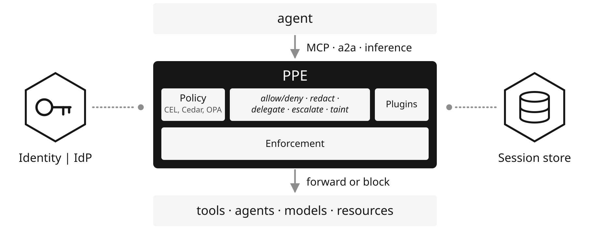

# Praxis Policy Engine Documentation

PPE is a typed policy runtime for AI middleware. It maps tools, resources,
prompts, inference calls, and conventional APIs to routes by entity type and
name. PPE combines global defaults, matching
groups, and route controls into phases that validate inputs, authorize
operations, apply effects, and transform results. The pipeline controls which
operations run, what data returns, and where it may flow.

Before policy evaluation, PPE verifies the caller with the IdP and maps subject,
role, and permission claims into attributes. The Policy stage evaluates
predicates and invokes CEL, Cedar, or OPA where configured. Effects can redact
data, request approval, apply session taint, or perform token exchange /
delegation for an audience-scoped upstream credential. The session store carries
information-flow labels across calls. PPE records the delegation chain and audit
history.

## Why it exists

- [Vision](vision.md):
  the Reference Monitor model and where PPE sits in an agent stack
- [Threat Model](threat-model.md):
  the adversary, the trust boundary, and what each placement defends

## Getting started

- [Quick Start](quickstart.md):
  stand up an enforcement point and run your first policy
- [Overview](overview.md):
  how it works, followed through one scenario end to end
- [Use Cases](use-cases.md):
  the controls running behind a real gateway

## Writing policy

- [APL](apl/index.md):
  routes, phases, predicates, rules, and field pipelines
- [Grammar](apl/apl-grammar.md):
  the normative grammar; where it and the parser disagree, one is a bug
- [Effects and Sequencing](apl/effects.md):
  the effect catalog, halt-on-deny, sequential and parallel composition
- [PDP Integration](apl/pdp.md):
  handing a decision to Cedar, CEL, or OPA
- [Identity](apl/identity.md):
  resolving a caller and what lands in the attribute bag
- [Static Attributes](apl/attributes.md):
  operator-maintained facts read under `data.*`
- [Delegation](apl/delegation.md):
  token exchange, delegation subjects, and token caching
- [Elicitation](apl/elicitation.md):
  human in the loop, and the suspend and resume model
- [Session Taint](apl/tainting.md):
  information flow labels that outlive a single call
- [Backend Restriction](apl/restrict.md):
  constraining where a call is allowed to land

## Configuring and operating

- [Configuration](configuration.md):
  the config document, its five top-level keys, and both dispatch modes
- [HTTP Routing](http-routing.md):
  the `http:` route selector, precedence, and the catch-all report
- [Identity and Delegation](identity-delegation.md):
  inbound identity slots, outbound delegation subjects, and six recipes
- [Header Assertions](assertions.md):
  projecting derived identity onto upstream requests
- [Auditing](auditing.md):
  decision records, write-ahead effect records, and writing a sink
- [Deployment](deployment.md):
  the same policy at a gateway, a sidecar, or in-framework
- [Patterns](patterns.md):
  layered enforcement, shadow rollout, guardrails, least privilege
- [Upgrading APL](../upgrade-apl.md):
  every key and form an existing configuration must rewrite

## Architecture

- [Plugins and Pipeline](pipeline.md):
  hooks, the plugin manager, and execution modes
- [Common Message Format](cmf.md):
  the protocol-agnostic envelope policy reasons about
- [Extensions and Capability Gating](extensions.md):
  typed contextual state, and the capabilities that unlock it

## Reference

- [Crates](crates.md):
  what each crate in the workspace is for
- [Builtins](builtins.md):
  bundled plugins, decision points, session stores, and their features
- [Testing](testing.md):
  testing a policy as code
