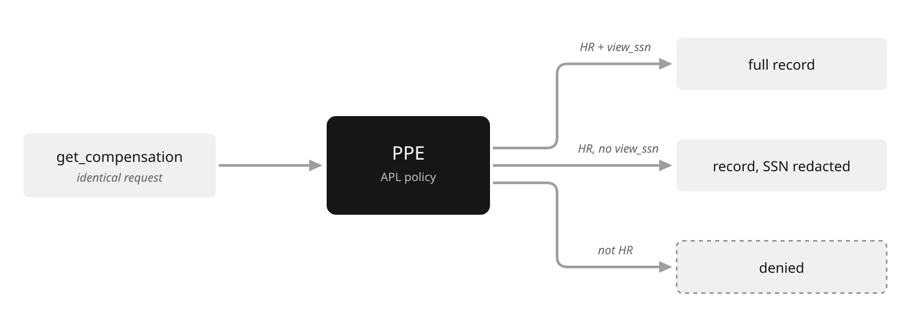

# How PPE Works

## A running scenario

One agent serves several people. It answers questions by calling tools
(an HR records service, a code repository, an email sender), invoking other
agents, running inference, and fetching prompts and resources. The
backends are shared. The callers are not: an HR analyst, an engineer, and a
support rep each drive the same agent with different identities and different
entitlements.

The R1–R6 labels in the diagram are the six requirements this scenario
places on the enforcement point. Each is a control PPE applies, and each maps to
a later page:

| Label | Requirement | Where |
|-------|-------------|-------|
| R1 | Resolve the real user behind the agent | [Identity](apl/identity.md) |
| R2 | Same request, different data (redact per identity) | [Effects](apl/effects.md) |
| R3 | Enforce on inputs and results (validate args, shape output) | [APL](apl/index.md) |
| R4 | Delegate downstream with a narrower credential | [Delegation](apl/delegation.md) |
| R5 | Remember the session (carry state across calls) | [Session Taint](apl/tainting.md) |
| R6 | Out-of-band elicitations (human approval) | [Elicitation](apl/elicitation.md) |

The agent's LLM decides which operation to run. It is untrusted. PPE sits
between it and every capability, and decides what actually happens. For each
operation, PPE resolves the caller's identity, evaluates the APL policy attached
to that operation, and applies the resulting effects before anything reaches the
backend. The same four phases run every time: validate arguments, evaluate
policy, transform the result, run post-policy checks.

## Same request, different data

The clearest demonstration is redaction on the wire. Three callers issue the
identical request, `get_compensation`. The backend returns the same record. What
each caller receives differs, because policy decides per identity.

```yaml
routes:
  - tool: get_compensation
    authorization:
      pre_invocation:
        - "require(role.hr)"
    result:
      ssn: "str | redact(!perm.view_ssn)"
```

- An HR analyst with the `view_ssn` permission gets the full record.
- An HR analyst without `view_ssn` gets the same record with the SSN redacted
  before it leaves PPE. The backend never sees the difference; the redaction
  happens at the boundary.
- An engineer is denied at `require(role.hr)`. The call never reaches the
  backend.



No application code changed between the three outcomes. The policy did.

## State that follows the session

Some controls depend on what already happened. When a caller reads compensation
data, the policy above marks the session with `taint(secret, session)`. A later
operation can refuse based on that label, even when its own payload is clean:

```yaml
routes:
  - tool: send_email
    authorization:
      pre_invocation:
        - "require(perm.email_send)"
        - "security.labels contains \"secret\": deny('session touched secret data', 'session_tainted')"
```

An email with no sensitive content in its body is still blocked if the session
previously read secret data. This is a write-down control, and the LLM cannot
route around it because the taint lives in PPE, not in the conversation.
[Session Taint](apl/tainting.md) defines label propagation and persistence.

## Where the boundary sits

PPE is the boundary, but the boundary can be placed in more than one spot. The
policy does not change; the enforcement point does.

A gateway in front of a tool server controls inbound calls. A sidecar on the
agent controls its outbound calls. An in-framework integration controls
operations as the runtime issues them. The same APL policy enforces in all
three. [Deployment](deployment.md) walks through each.

## Related documentation

- [Use Cases](use-cases.md): run the controls above end to end behind a gateway.
- [APL](apl/index.md): the enforcement-pipeline configuration.
- [Identity](apl/identity.md): how callers are resolved into the attributes
  policy reads.
