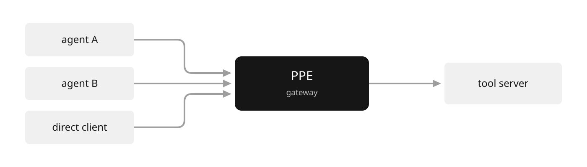
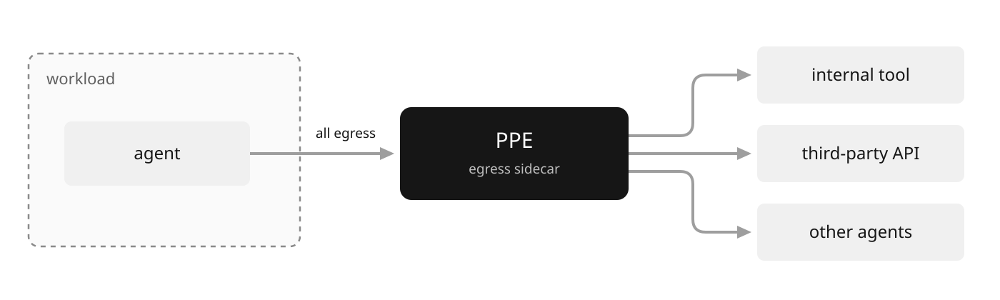
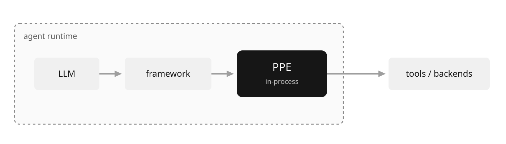

# Threat Model

This threat model defines the assumed adversary, the Reference Monitor boundary,
and the coverage of each deployment placement.

## The adversary

PPE assumes the LLM driving an agent is compromised, or close enough that the
difference does not matter. Three things make it untrusted:

- Its inputs are attacker-reachable. Prompt injection can arrive through any
  content the model reads: user messages, tool results, fetched resources, other
  agents' replies.
- Its outputs are attacker-shaped. An injected instruction becomes a tool
  call, an argument value, an email body. The model is a confused deputy: it
  acts with the agent's authority on whoever's behalf the text says.
- It cannot keep secrets or enforce rules. Anything in the context window
  can be exfiltrated through an allowed output channel, and any instruction in
  the prompt can be overridden by a later one.

The assets at stake sit behind the agent: backend data (records, code, mail),
the credentials the agent holds, tools with side effects (payments, writes,
messages), and the integrity of the audit trail itself.

The consequence is the Reference Monitor rule: authorization, Token Exchange /
Delegation, and information-flow decisions cannot live in the model, in the
prompt, or in agent code the model steers. They live at a boundary the model's
output must cross, evaluated against state the model cannot see or forge.

## The trust boundary

PPE draws that boundary. Every operation the agent attempts crosses it; nothing
the model emits reaches a capability directly.

Everything to the left of the monitor is assumed hostile, and nothing the policy
reads comes from there: verified tokens come from the IdP (identity provider),
decisions from the PDP, Session Taint labels from the session store, and the
delegation and audit state is PPE's own. The model can ask for anything; it can
influence none of the state the answer depends on.

## Threats and controls

| Threat | Without mediation | PPE control |
|---|---|---|
| Prompt-injection-driven tool misuse | injected text becomes an executed tool call | `require(...)` attribute gates and `args` validation run before dispatch; a PDP decides relationship questions ([Effects](apl/effects.md), [PDP](apl/pdp.md)) |
| Confused deputy / privilege escalation | the agent acts with one blanket identity for all callers | identity resolved per caller from verified tokens; entitlements differ per subject, not per prompt ([Identity](apl/identity.md)) |
| Cross-request data exfiltration (write-down) | data read in one call leaves through a later, innocent-looking call | `taint(...)` labels the session in PPE-owned state; later operations deny on the label even with clean payloads ([Session Taint](apl/tainting.md)) |
| Credential exposure and over-broad tokens | backends receive the caller's raw IdP credential | `delegate(...)` exchanges it for a fresh audience-scoped token (RFC 8693); the granted scope is verified before use ([Delegation](apl/delegation.md)) |
| PII disclosure | sensitive values flow into arguments and out in results | PII scanning on `args`, field-level `redact`/`mask` pipelines on `result` ([Builtins](builtins.md)) |
| Unauthorized high-impact actions | the model triggers irreversible operations on its own authority | `require_approval(...)` suspends the call for out-of-band human sign-off ([Elicitation](apl/elicitation.md)) |
| Approval replay | one sign-off is reused for a larger or different action | approvals are scope-bound to the live arguments and validated on resume ([Elicitation](apl/elicitation.md)) |
| Unaccountable actions | no trustworthy record of what the agent did | an audit plugin emits an append-only record per decision, including denied attempts ([Patterns](patterns.md)) |

No single row is load-bearing alone. The [defense-in-depth
pattern](patterns.md#defense-in-depth) composes them in one route.

## Where the boundary sits, and what each placement covers

PPE is direction-agnostic: the same APL policy enforces at any placement (see
[Deployment](deployment.md)). The placement decides which traffic is mediated,
which is the threat-model question: an enforcement point only stops what crosses
it.

### Proxy / gateway (inbound)

PPE fronts a tool server. Every request to that backend crosses the boundary,
whichever agent or client sent it.

Covers

- Every caller of the protected backend, including agents you do not operate and
  callers that bypass the "official" agent.
- On-the-wire transformation: the backend never sees redacted values, and never
  sees the caller's raw IdP credential when delegation mints a scoped token.
- A single audit chokepoint for the resource.

Does not cover

- Anything the agent does that never touches this backend: other tools, other
  APIs, side channels.
- Agent-internal context. The gateway sees requests, not the conversation, so
  per-turn or lineage-based policy has less to read.

This is the placement in the end-to-end [Praxis demo](use-cases.md).

### Endpoint / workload sidecar (outbound)

PPE sits beside one agent and mediates its egress. Everything that agent emits
crosses the boundary, whatever it targets.

Covers

- The complete outbound surface of the workload, including third-party APIs you
  do not control and could never gateway.
- Workload identity: the `caller_workload.*` attributes carry attested
  identity (SPIFFE / mTLS), so policy can bind decisions to which workload is
  calling, not just which user.
- Exfiltration control for a specific agent: taint follows the session across
  every backend the agent reaches.

Does not cover

- Other paths to the same backends. The sidecar protects the world from this
  agent, not the backend from other callers.
- Traffic that escapes the sidecar's capture. Egress must be forced through it
  at the network level, or the guarantee is advisory.
- Inference traffic, unless you deliberately route it through the policy path
  (see [Deployment](deployment.md#inference-traffic)).

### Agent / agentic framework (in-process)

PPE runs inside the agent runtime and mediates operations as the framework
issues them.

Covers

- The richest policy context: `agent.*` (session, conversation, turn, lineage)
  and `framework.*` (node and graph ids) attributes let policy reason about
  where in the agent's execution an operation originates.
- Enforcement before any network hop, including on operations that never leave
  the process.
- Human-in-the-loop and taint decisions at the reasoning step, closest to the
  intent.

Does not cover

- Process-level compromise. PPE shares the agent's process; code execution in
  the runtime can bypass an in-process monitor. This placement hardens the
  agent's decisions, not its host.
- Traffic from anything other than this runtime.

### Compose them

The placements are not alternatives. The strongest posture pairs an in-framework
monitor (rich context, soft and enforcement-tier policy) with a gateway or
sidecar at an infrastructure boundary the agent process cannot rewrite
(hard-tier policy: identity, information flow, audit). That is the policy
spectrum from [Vision](vision.md#the-policy-spectrum): the same APL object at
every point, so layering placements costs no policy duplication.

## Out of scope

PPE is a Reference Monitor, not a model alignment technique. Explicitly outside
this threat model:

- Model-internal behavior. PPE constrains what the model's decisions can do,
  not what the model decides. A jailbroken model behind PPE still only reaches
  what policy allows.
- Covert channels inside allowed traffic. If policy permits an output
  channel, a determined model can encode data into it. Taint narrows this (deny
  the channel once secrets are touched); it does not eliminate encoding within
  permitted flows.
- Compromise of the PPE host. The monitor's guarantees hold only as long as
  the process and state stores it depends on are intact. Run hard-tier
  enforcement on infrastructure with a smaller attack surface than the agent it
  guards.
- Backends themselves. PPE decides what reaches a tool and what comes back;
  it does not vouch for what the tool does internally.

A policy-enforcement bypass is our critical severity class. Report it
privately via the process in
[SECURITY.md](https://github.com/praxis-proxy/policy/blob/main/SECURITY.md).

## Related documentation

- [Quick Start](quickstart.md): stand up an enforcement point and load a policy.
- [Overview](overview.md): follow the enforcement pipeline through one scenario.
- [Use Cases](use-cases.md): run the controls end to end in a gateway deployment.
